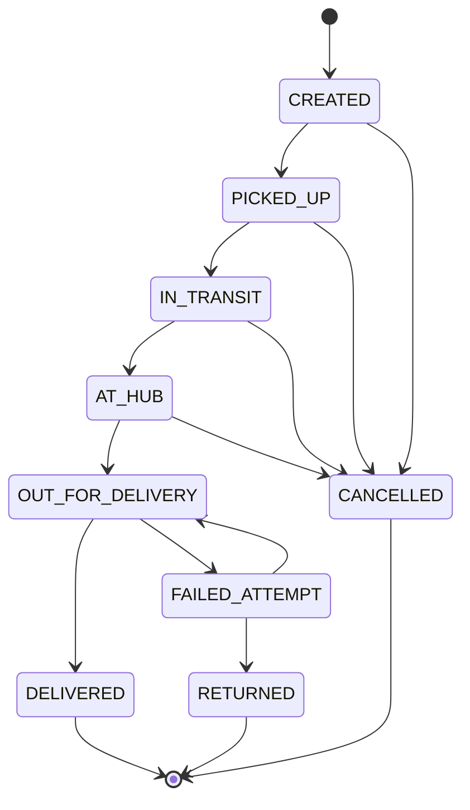
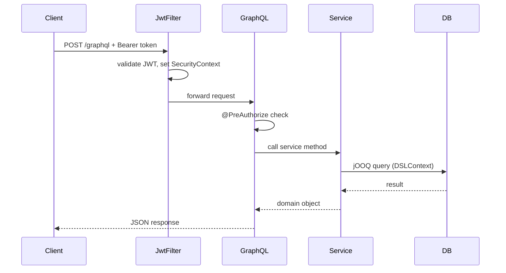

# CargoFlow

A logistics management API built as a portfolio project to demonstrate production-ready backend development with Java and Spring Boot. Covers the full backend stack: security, domain logic, search, observability, and infrastructure.

---

## Tech Stack

| Layer | Technology |
|---|---|
| Language | Java 21 |
| Framework | Spring Boot 4.0.5 |
| API | Spring GraphQL |
| Database | PostgreSQL + jOOQ (no JPA/Hibernate) |
| Migrations | Liquibase |
| Search | Elasticsearch 9 (full-text autocomplete) |
| Security | Spring Security + JWT (stateless) |
| Infrastructure | Docker Compose (auto-start) |
| Observability | Spring Boot Actuator (`/actuator/health`, metrics) |
| Testing | JUnit 5, Mockito, Testcontainers |
| CI/CD | GitHub Actions |

> **Why jOOQ instead of JPA?** jOOQ gives full control over SQL — no N+1 problems, no magic, explicit queries. Every JOIN is intentional.

---

## Features

- **Auth** — register and login with JWT token response
- **Role hierarchy** — `ADMIN` → `MANAGER` → `SHIPPER`, enforced via `@PreAuthorize` on every resolver
- **Shipment lifecycle** — create, track by number, assign carrier, update status, cancel
- **Price calculation** — real distance via Nominatim geocoding API (OpenStreetMap) + haversine formula + volumetric weight + fragile multiplier
- **Address autocomplete** — Elasticsearch `search_as_you_type` with full-text search
- **Event-driven indexing** — addresses indexed to ES after commit via `@TransactionalEventListener`
- **Pagination** — `getAllShipments(page, size)` with jOOQ `LIMIT/OFFSET`
- **Observability** — `/actuator/health` with component details (DB, ES, disk)
- **Global error handling** — 404, 409, 401, 500 mapped to GraphQL errors

---

## Architecture

```mermaid
graph TD
    Client -->|HTTP + JWT Bearer| GraphQL[GraphQL Layer<br/>@QueryMapping / @MutationMapping]
    GraphQL -->|delegates| Service[Service Layer<br/>@Transactional, business logic]
    Service -->|SQL via DSLContext| Repository[Repository Layer<br/>jOOQ, manual mapping]
    Service -->|HTTP| Nominatim[Nominatim API<br/>OpenStreetMap geocoding]
    Repository --> PostgreSQL[(PostgreSQL)]
    Service -->|ApplicationEvent| ESListener[AddressIndexListener<br/>@TransactionalEventListener]
    ESListener --> Elasticsearch[(Elasticsearch 9)]
    Client -->|no auth| Actuator[/actuator/health]
```

---

## Shipment Status State Machine



---

## Request Flow



---

## Price Calculation

Shipment price is computed from real-world data — not hardcoded rates:

1. **Geocoding** — addresses are geocoded via [Nominatim](https://nominatim.openstreetmap.org) (OpenStreetMap) on shipment creation, coordinates stored in DB
2. **Distance** — haversine formula on stored coordinates (great-circle distance in km)
3. **Effective weight** — `max(actual weight, volumetric weight)` where volumetric = `W×H×L / 5000`
4. **Fragile surcharge** — ×1.5 multiplier if any parcel is fragile
5. **Rate** — `0.01 USD per kg·km` (result currency: USD)

```graphql
query {
  shipmentPrice(id: 1)  # returns BigDecimal
}
```

---

## Getting Started

**Prerequisites:** Docker Desktop, Java 21, Maven

```bash
# 1. Clone the repository
git clone https://github.com/qqrayzqq/cargoflow.git
cd cargoflow

# 2. Run the application — Docker Compose starts automatically
./mvnw spring-boot:run
```

- GraphQL playground: `http://localhost:8080/graphiql`
- Health check: `http://localhost:8080/actuator/health`

Liquibase migrations run automatically on startup.

---

## GraphQL Examples

### Register and get JWT token
```graphql
mutation {
  register(input: {
    username: "john_doe"
    email: "john@example.com"
    password: "secret123"
    fullName: "John Doe"
  })
}
```

### Create a shipment
```graphql
mutation {
  createShipment(input: {
    fromAddress: { country: "DE", zip: "10115", city: "Berlin", street: "Unter den Linden", buildingNumber: "1" }
    toAddress:   { country: "IT", zip: "00100", city: "Rome", street: "Via del Corso", buildingNumber: "10" }
    parcels: [{ weight: 2.5, width: 30.0, height: 20.0, length: 40.0, isFragile: false }]
  }) {
    id
    trackingNumber
    status
  }
}
```

### Get shipment price (authenticated)
```graphql
query {
  shipmentPrice(id: 1)
}
```

### Track a shipment (no auth required)
```graphql
query {
  getShipmentByTrackingNumber(trackingNumber: "A1B2C3D4E5F6") {
    trackingNumber
    status
    fromAddress { city }
    toAddress { city }
    events { status occurredAt }
  }
}
```

### Address autocomplete (Elasticsearch)
```graphql
query {
  searchAddresses(query: "Ber") {
    id
    city
    street
  }
}
```

---

## Security Model

All endpoints require `Authorization: Bearer <token>` except `register`, `login`, and `getShipmentByTrackingNumber`.

| Role | Access |
|---|---|
| `SHIPPER` | Create shipments, view own shipments, cancel, get price |
| `MANAGER` | Everything above + view all shipments, assign carriers, update status |
| `ADMIN` | Full access (inherits MANAGER via Spring role hierarchy) |

---

## Testing

```
Unit tests (Mockito)
  ShipmentServiceTest   — business logic in full isolation
  ShipmentResolverTest  — resolver delegation to service

Integration tests (Testcontainers + real PostgreSQL)
  UserRepositoryTest    — jOOQ queries against real DB schema
```

```bash
./mvnw test
```

CI runs on every push to `master`/`develop` and on pull requests.

---

## Database Schema

Managed by Liquibase (9 migrations). Core tables:

```
users ──────────────► shipments ──► parcels
                          │
              ┌───────────┴───────────┐
              ▼                       ▼
        from_address            to_address
         (addresses)            (addresses)
              │                       │
              └─── lat/lon stored ────┘
                   for price calc

shipments ──► shipment_events
shipments ──► carriers  (nullable — carrier assigned later)
```

---

## What I Learned Building This

- Writing complex SQL with jOOQ manually (multi-table LEFT JOINs, aliased self-joins, manual record mapping)
- Designing a stateless JWT security chain from scratch without Spring Security defaults
- Integrating a third-party geocoding API (Nominatim) with rate limiting
- Implementing domain pricing logic with BigDecimal (haversine + volumetric weight)
- Indexing data to Elasticsearch reliably using transactional event listeners (no dual-write inconsistency)
- Structuring a GraphQL API with role-based access control at the resolver level
- Writing tests at multiple layers: unit, integration, and resolver level
